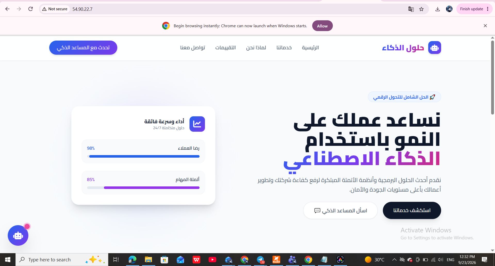
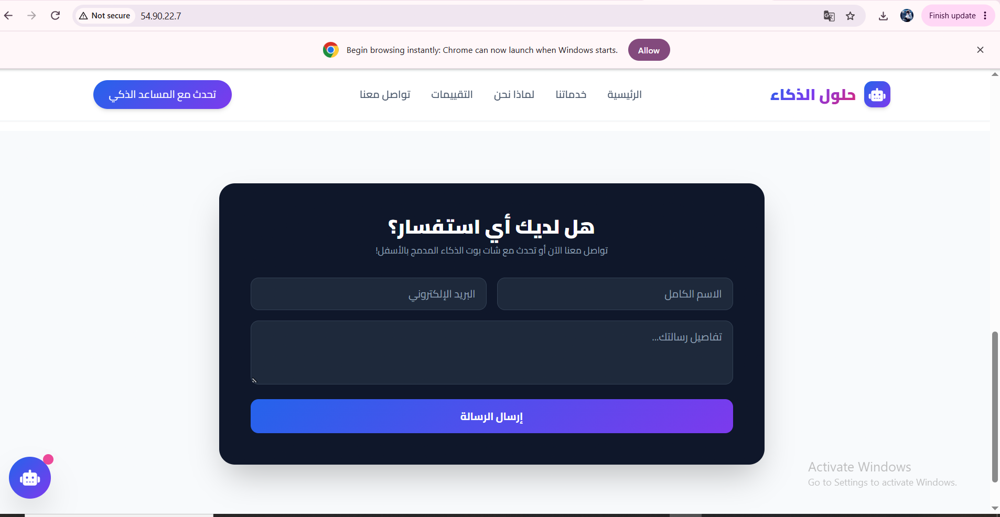
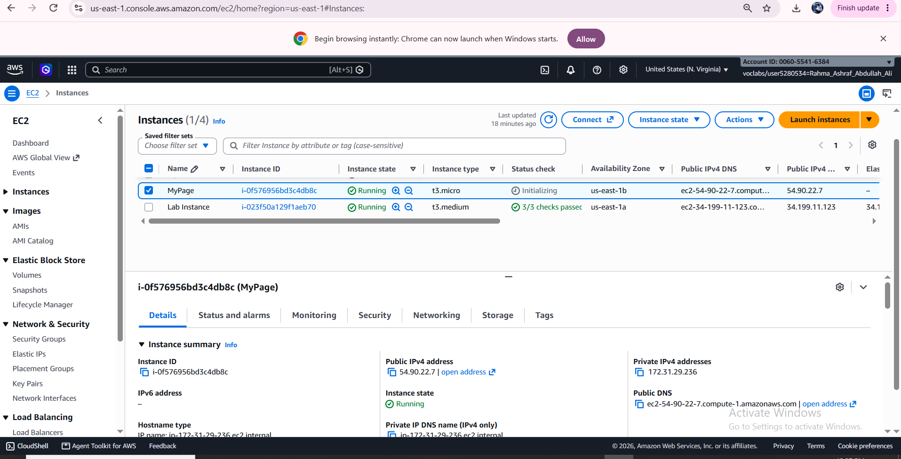
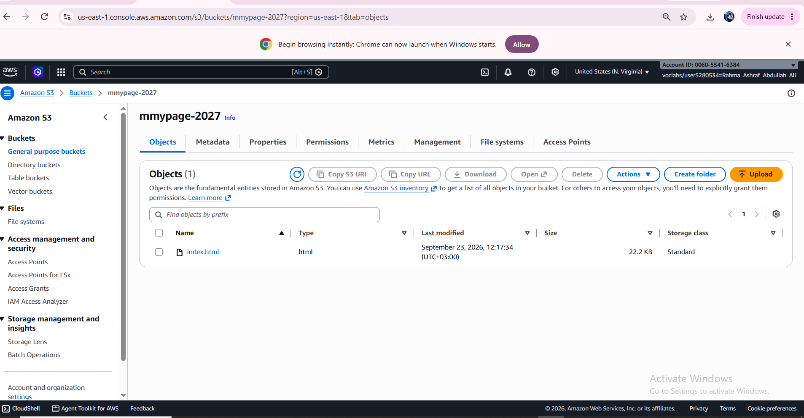

# ☁️ AI Solutions Platform: AWS Cloud Architecture & Integrated AI Assistant

An enterprise-ready digital transformation and AI services landing page featuring an embedded conversational AI Assistant. Architected and deployed across Amazon Web Services (AWS) infrastructure following best practices for decoupling static storage from compute environments.

---

## 🌐 Live Interactive Demo
- Explore Live Deployment: https://Rahmah2005.github.io/aws-cloud-ai-landing-page/

---

## 🏛️ System Architecture

1. Compute Layer (Amazon EC2):
   - Instance Type: t3.micro running Amazon Linux.
   - Web Server: Apache (httpd) serving traffic over public HTTP.
   - Automation: Fully configured via User Data bootstrap script.

2. Storage Layer (Amazon S3):
   - Bucket Name: mmypage-2027
   - Serves as the central repository storing the web application source code (index.html).

3. Security & Identity (AWS IAM):
   - Attached an IAM Instance Profile (Role) to the EC2 instance granting read access to S3, enforcing the Least Privilege principle without embedded credentials.

4. Network & Firewall (Security Groups):
   - Inbound HTTP (Port 80) open to internet traffic (0.0.0.0/0).

5. AI Assistant Widget:
   - Interactive client-side chat interface answering user questions regarding cloud services, scalability, and security.

---

## 📸 Deployment Proof & Verification

### 1. Live Web Application Overview & UI Sections

*Figure 1: Main landing page hero section showcasing AI digital transformation services.*

*Figure 2: Service architecture and business automation capabilities.*

*Figure 3: Platform client feedback and customer engagement sections.*

### 2. Interactive Conversational AI Assistant

*Figure 4: Active embedded AI assistant handling real-time customer queries.*

### 3. AWS EC2 Compute Layer & Networking

*Figure 5: EC2 instance verification in running state with public IPv4 allocation.*

### 4. Amazon S3 Storage Layer

*Figure 6: Centralized asset repository hosting source files in bucket mmypage-2027.*
---

## ⚙️ Automated Deployment Script (User Data)

`bash
#!/bin/bash
dnf update -y
dnf install -y httpd awscli
systemctl start httpd
systemctl enable httpd
aws s3 cp s3://mmypage-2027/index.html /var/www/html/index.html
chmod 644 /var/www/html/index.html
## 🔒 Enterprise Production Comparison (Lab vs. Real-World)

| Feature | Demonstration Lab | Enterprise Production |
| :--- | :--- | :--- |
| DNS / Routing | Direct Public IPv4 Address | Amazon Route 53 with custom domains |
| Security | HTTP (Port 80) | HTTPS (Port 443) via SSL/TLS certificates |
| Certificates | None | Managed via AWS Certificate Manager (ACM) |
| Scalability | Single Instance (t3.micro) | ALB + Auto Scaling Groups |
| CDN | Direct server delivery | Amazon CloudFront Global Edge Network |
---

## 👤 Author
- Developer: Rahmah
- GitHub: [@Rahmah2005](https://github.com/Rahmah2005)
